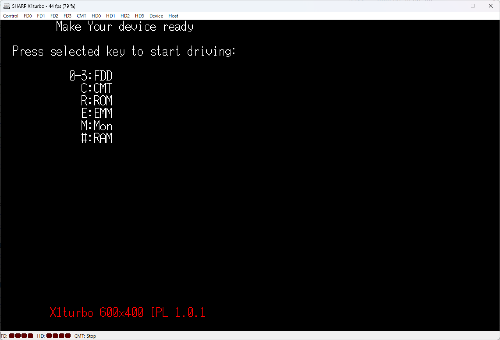
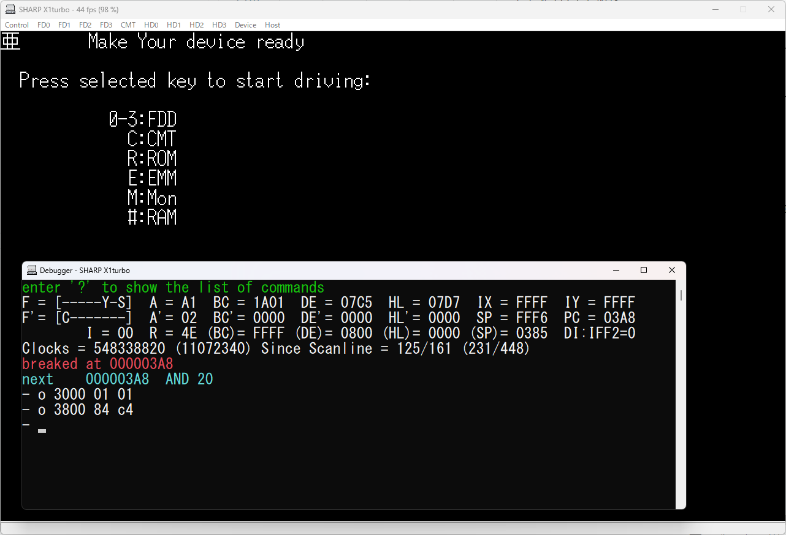

#  X1 compatible ROM ver 0.7.3 for X1 turbo

## はじめに

これは meister68k 氏の GiHub リポジトリ 
[X1_compatible_rom](https://github.com/meister68k/X1_compatible_rom)
をフォークし、X1 turbo 用として IPL 起動直後から漢字 VRAM を利用可能となるよう手を加えたものです。

注）オリジナルの README.md は [README-original.MD](README-original.MD) です。IPL の仕様についてはそちらを参照ください。

## 修正内容

- CRTC 初期化パラメータを高解像度（80 桁、400 ライン）用に変更
- I/O ポート 1A02 で80 桁指定
- I/O ポート 1FD0 で 400 ライン指定
- 80 桁化に合わせ
    - メッセージ表示位置を修正
    - 画面初期化時のテキスト VRAM/アトリビュートのクリア範囲を拡大
    - 画面初期化時の漢字 VRAM の初期化追加

##  IPL イメージ

| ファイル名   | 内容                                          |
| --           | --                                            |
| IPLROM-40.X1 | オリジナルの X1_compatible_rom.bin と同一内容 |
| IPLROM-80.X1 | オリジナルの画面構成を 80桁へ変更             |
| IPLROM.X1T   | X1 turbo 高解像度対応                         |

- 確認は武田氏の x1turbo.exe で確認しています。

## 画面

### 起動画面

### 漢字表示例

## ビルド

- build.cmd （Windows 用）を実行すると上述の 3 つの  IPL イメージを生成します。
- 本リポジトリ内の makefile はオリジナルのままのもので使用しません。
- アセンブラは AILZ80ASM を使用します。
- コマンドラインからのラベル定義（-dl）でビルドを分けています。

| ターゲット    | -dl 指定 |
| --            | --       |
| IPLROM-40.X1  | WIDTH=40 |
| IPLROM-80.X1  | WIDTH=80 |
| IPLROM.X1T    | TURBO    |

## ライセンス

- フォーク元の [X1_compatible_rom](https://github.com/meister68k/X1_compatible_rom) のライセンスに準じます。
（[CC0](https://creativecommons.org/publicdomain/zero/1.0/deed.ja)）

## 関連リンク・リポジトリ（自作分含む）

- フォーク元リポジトリ [X1_compatible_rom](https://github.com/meister68k/X1_compatible_rom)
- アセンブラ [AILZ80ASSM](https://github.com/AILight/AILZ80ASM)
- 武田氏エミュレータ [TAKEDA, toshiya's HOME PAGE](http://takeda-toshiya.my.coocan.jp/)
- 武田氏エミュレータ修正版 [enhance-TAKEDAs-emulator](https://github.com/dogatana/enhance-TAKEDAs-emulator)

## 謝辞

フォーク元の互換 IPL 作者 meister68k 氏に深く感謝します。

